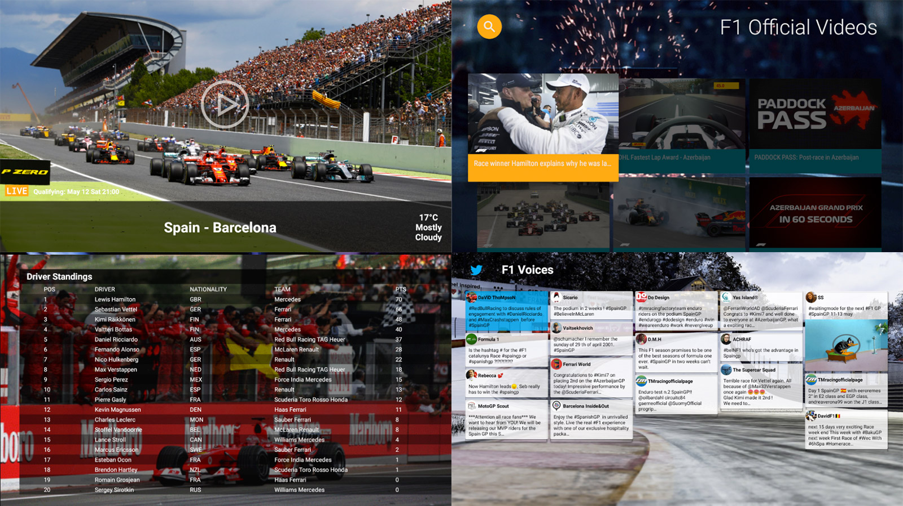

# f1live-leanback

f1live is an experimental F1 Race watching app for Android TV. It is designed to satisfy my need of a better race watching experience on my Android TV during match days. 

## What it can do

+ Watch the amazing racing match

+ View offical videos

+ Check driver & team standings

+ Follow the latest tweets from crazy fans all over the world!

## Screenshots

## Installation
1. System requirement: Android TV (Android 5.0 or up).

2. Download the [f1live app installation package](https://github.com/q1yh/f1live-leanback/raw/master/f1live-dist.apk) to your local storage.

3. Execute the downloaded package in one of your favorite file managers(like ES File Explorer,etc), complete the installation.

4. Volia, the app should be successfully installed, enjoy! 

## Code

This APP is partially referenced by my previous project [Cantv-leanback](https://github.com/q1yh/cantv-leanback/), and plus I developped [Twitterwall](https://github.com/q1yh/twitterwall/), a general tweets data collection and stagged grid view render, which was publish independently so it could be merged into any other project easily.

## License

Licensed under the Apache 2.0 license. See the [LICENSE file][license] for details.

[license]: LICENSE

